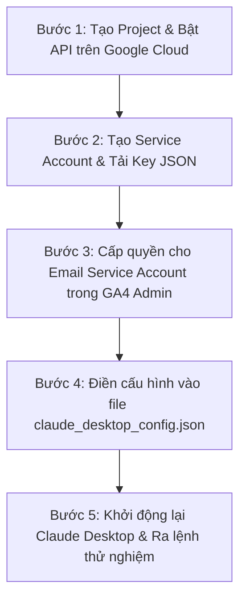

# 📊 CẨM NANG CHI TIẾT A-Z: CẤU HÌNH GOOGLE ANALYTICS 4 (GA4) MCP SERVER CHO CLAUDE DESKTOP

> **Dành cho mọi đối tượng:** Bài hướng dẫn này được biên soạn chi tiết từng bước, kết hợp giao diện tiếng Việt & tiếng Anh để ngay cả người không am hiểu công nghệ cũng có thể tự thực hiện thành công 100%.

---

## 💡 1. Khái Niệm Cơ Bản & Cơ Chế Hoạt Động

### GA4 MCP Server Là Gì?
**MCP (Model Context Protocol)** là giao thức giúp trí tuệ nhân tạo **Claude Desktop** có thể trực tiếp kết nối và truy vấn dữ liệu báo cáo từ tài khoản Google Analytics 4 (GA4) của bạn. Thay vì phải đăng nhập website xem biểu đồ thủ công, bạn chỉ cần chat với Claude bằng tiếng Việt tự nhiên (ví dụ: *"Cho tôi xem lượng truy cập tuần qua"*), Claude sẽ tự động gọi API để trả lời ngay lập tức.

### Cơ Chế Xác Thực: Service Account (Tài Khoản Dịch Vụ) Là Gì?
- Hãy hình dung **Service Account** như một "Robot nhân viên ảo" do Google cấp riêng cho bạn.
- Robot này có địa chỉ Email riêng (dạng `ga4-reader@xxxx.iam.gserviceaccount.com`) và một "Chìa khóa bảo mật" dạng tệp tin **JSON** (`google-key.json`).
- Bạn chỉ cần cấp quyền xem báo cáo cho "Robot" này trong GA4, sau đó đưa "Chìa khóa JSON" cho Claude Desktop giữ. Claude sẽ đại diện cho Robot để lấy dữ liệu về cho bạn một cách an toàn tuyệt đối.

---

## 📋 2. Tổng Quan 5 Bước Thực Hiện



---

## 🛠️ BƯỚC 1: Tạo Project & Bật Google Analytics Data API Trên Google Cloud Console

1. Truy cập vào trang quản trị Google Cloud Console tại link:
   👉 **[https://console.cloud.google.com/](https://console.cloud.google.com/)** *(Đăng nhập tài khoản Google/Gmail của bạn)*.

2. **Tạo Dự án mới (Project):**
   - Nhìn lên thanh header màu xanh ở trên cùng ➔ Bấm vào ô chọn dự án (ngay bên phải logo *Google Cloud*).
   - Trong cửa sổ popup hiện ra, bấm vào nút **NEW PROJECT** (Dự án mới) ở góc trên bên phải.
   - **Project Name (Tên dự án):** Gõ tên gợi nhớ (Ví dụ: `GA4-MCP-Claude`).
   - Nhấn **CREATE** (Tạo) và chờ khoảng 5-10 giây để Google khởi tạo.
   - Bấm chọn đúng dự án `GA4-MCP-Claude` vừa tạo.

3. **Bật Google Analytics Data API:**
   - Mở Menu bên trái (Biểu tượng 3 dấu gạch ngang ☰ ở góc trên bên trái).
   - Chọn **APIs & Services** (API và Dịch vụ) ➔ Chọn **Library** (Thư viện).
   - Tại ô tìm kiếm ở giữa màn hình, gõ chính xác: `Google Analytics Data API`.
   - Nhấp chuột vào ô kết quả **Google Analytics Data API** (Tên kỹ thuật: `analyticsdata.googleapis.com`).
   > [!IMPORTANT]
   > Hãy chú ý chọn đúng **Google Analytics Data API**. KHÔNG chọn *Google Analytics Admin API* hay *Reporting API v4* cũ.
   - Nhấn nút màu xanh **ENABLE** (Bật).

---

## 🔑 BƯỚC 2: Tạo Service Account & Tải Tệp Chìa Khóa Bảo Mật JSON

1. Mở lại Menu bên trái (☰) ➔ **APIs & Services** (API và Dịch vụ) ➔ Chọn **Credentials** (Thông tin xác thực).
2. Ở mép trên màn hình, bấm vào nút **+ CREATE CREDENTIALS** (Tạo thông tin xác thực) ➔ Chọn **Service account** (Tài khoản dịch vụ).
3. Điền thông tin cơ bản:
   - **Service account name:** Gõ `ga4-mcp-reader`.
   - **Service account ID:** Tự động điền.
   - **Description:** Gõ `Cấp quyền đọc báo cáo GA4 cho Claude Desktop`.
   - Bấm **CREATE AND CONTINUE** (Tạo và tiếp tục).
   - Bấm **DONE** (Hoàn tất) để kết thúc form (không cần chọn quyền ở các bước phụ).

4. **Copy Địa Chỉ Email Của Service Account:**
   - Tại danh sách *Service Accounts*, bạn sẽ thấy một email mới tạo có dạng:
     `ga4-mcp-reader@ga4-mcp-claude.iam.gserviceaccount.com`
   - 👉 **Hãy bôi đen và COPY lại địa chỉ Email này!** *(Bạn sẽ dán email này vào GA4 ở Bước 3).*

5. **Tải File Chìa Khóa JSON:**
   - Bấm trực tiếp chuột vào tên email Service Account vừa tạo.
   - Ở thanh menu phía trên, chuyển sang tab **KEYS** (Khóa).
   - Bấm vào nút **ADD KEY** ➔ Chọn **Create new key** (Tạo khóa mới).
   - Chọn định dạng **JSON** ➔ Bấm **CREATE**.
   - Một tệp tin dạng `.json` sẽ tự động được tải về máy tính (Ví dụ: `ga4-mcp-claude-123456.json`).

6. **Lưu File Key Vào Thư Mục MCP:**
   - Đổi tên tệp vừa tải về thành: **`google-key.json`**.
   - Di chuyển tệp `google-key.json` này vào đúng thư mục:
     `C:\Users\PC\.gemini\antigravity-ide\scratch\ga4-mcp-server\google-key.json`

---

## 📊 BƯỚC 3: Cấp Quyền Đọc Dữ Liệu Trong Trang Quản Trị GA4 Admin

Sau khi có Email của "Robot nhân viên ảo", bạn phải vào GA4 để cho phép Robot này đọc báo cáo.

1. Truy cập trang web Google Analytics: 👉 **[https://analytics.google.com/](https://analytics.google.com/)**.
2. Đảm bảo bạn đang chọn đúng **Tài khoản** và **Thuộc tính (Property)** muốn kết nối.
3. Ở góc dưới cùng bên trái màn hình, nhấn vào biểu tượng bánh răng **Admin** (Quản trị).
4. Trong cột thứ hai **Property** (Thuộc tính):
   - Bấm chọn **Property Access Management** (Quản lý quyền truy cập thuộc tính).
5. Nhấn vào nút dấu cộng màu xanh `+` ở góc trên bên phải ➔ Chọn **Add users** (Thêm người dùng).
6. Tại ô **Email addresses** (Địa chỉ email):
   - Dán địa chỉ email Service Account đã copy ở Bước 2 vào (Ví dụ: `ga4-mcp-reader@ga4-mcp-claude.iam.gserviceaccount.com`).
7. Tại mục **Direct roles and data restrictions** (Vai trò trực tiếp):
   - Tích chọn quyền **Viewer** (Người xem).
   > [!NOTE]
   > Quyền *Viewer* cho phép Claude đọc đầy đủ số liệu báo cáo mà không có quyền thay đổi hay xóa cấu hình GA4 của bạn, đảm bảo an toàn tuyệt đối.
8. Bỏ tích chọn *Notify new users by email* (Thông báo cho người dùng mới qua email).
9. Nhấn nút **Add** (Thêm) ở góc trên bên phải.

---

### 📌 Hướng Dẫn Tìm Lấy GA4 Property ID (10 Chữ Số)
Khi ra lệnh cho Claude, Claude sẽ hỏi bạn **Property ID** của GA4:
1. Cũng trong trang **GA4 Admin** ➔ Cột **Property** (Thuộc tính).
2. Bấm vào mục **Property Details** (Chi tiết thuộc tính).
3. Nhìn sang góc phải màn hình, bạn sẽ thấy mục **PROPERTY ID** (Mã thuộc tính) chứa dãy số (Ví dụ: `412345678` hoặc `398765432`).
4. 👉 Ghi lại dãy 9-10 chữ số này để dùng khi hỏi Claude.

---

## 🖥️ BƯỚC 4: Cấu Hình Tệp `claude_desktop_config.json` Trên Máy Tính

1. Nhấn tổ hợp phím **`Windows + R`** trên bàn phím để mở hộp thoại *Run*.
2. Nhập chính xác đoạn lệnh sau và ấn **Enter**:
   ```text
   %APPDATA%\Claude\claude_desktop_config.json
   ```
   *(Nếu Windows hỏi mở bằng phần mềm nào, hãy chọn Notepad hoặc Visual Studio Code).*

3. Dán đoạn mã cấu hình dưới đây vào file:

```json
{
  "mcpServers": {
    "ga4-local": {
      "command": "node",
      "args": [
        "C:\\Users\\PC\\.gemini\\antigravity-ide\\scratch\\ga4-mcp-server\\index.js"
      ],
      "env": {
        "GOOGLE_APPLICATION_CREDENTIALS": "C:\\Users\\PC\\.gemini\\antigravity-ide\\scratch\\ga4-mcp-server\\google-key.json"
      }
    }
  }
}
```

> [!CAUTION]
> **Lưu ý quan trọng về cú pháp đường dẫn trên Windows:**
> Trong file JSON, tất cả các dấu xuyệt ngược trong đường dẫn phải được viết đúp hai lần `\\` (Ví dụ: `C:\\Users\\PC\\...`) hoặc dùng dấu xuyệt đơn `/` (Ví dụ: `C:/Users/PC/...`). Nếu viết dấu xuyệt đơn `\`, file config sẽ bị lỗi cú pháp làm ứng dụng Claude không nhận diện được plugin.

---

## 🚀 BƯỚC 5: Khởi Động Lại Claude Desktop & Trải Nghiệm

1. Đóng hoàn toàn phần mềm Claude Desktop:
   - Nhìn xuống góc dưới bên phải thanh Taskbar Windows (gần đồng hồ giờ).
   - Nhấp chuột phải vào biểu tượng ứng dụng **Claude** ➔ Chọn **Quit Claude**.
2. Mở lại ứng dụng **Claude Desktop**.
3. Nhìn vào góc dưới bên phải của ô nhập nội dung chat, bạn sẽ thấy xuất hiện biểu tượng chiếc búa **🛠️ (MCP Tools)**. Nhấn vào đó để kiểm tra 3 công cụ GA4 đã sẵn sàng:
   - 🟢 `get_realtime_active_users`: Thống kê người dùng thời gian thực.
   - 🟢 `get_traffic_report`: Báo cáo tổng lượng truy cập (Users, Sessions, Pageviews).
   - 🟢 `get_top_pages`: Báo cáo danh sách trang được xem nhiều nhất.

---

## 💬 Mẫu Câu Lệnh Nói Chuyện Với Claude (Tiếng Việt)

Bây giờ bạn có thể mở khung chat với Claude và hỏi tự nhiên:

- 📈 **Hỏi truy cập Realtime (30 phút qua):**
  > *"Xem giúp tôi hiện tại có bao nhiêu người dùng đang online realtime trên trang web (GA4 Property ID: 412345678)?"*
- 📊 **Hỏi báo cáo lượng truy cập theo khoảng thời gian:**
  > *"Tổng hợp báo cáo lượt truy cập (Active Users, Sessions, Pageviews) từ ngày 30daysAgo đến today cho GA4 Property 412345678 giúp tôi."*
- 🏆 **Hỏi danh sách các bài viết hot nhất:**
  > *"Cho tôi xem danh sách Top 10 bài viết được đọc nhiều nhất trong 7 ngày qua của GA4 Property 412345678."*

---

## ❓ Bảng Giải Trừ Sự Cố & Lỗi Thường Gặp (Troubleshooting)

| Mã lỗi / Hiện tượng | Nguyên nhân | Cách khắc phục triệt để |
|---|---|---|
| **Lỗi 403: Permission Denied** | Bạn chưa thêm Email Service Account vào GA4 Admin hoặc gán sai quyền. | Mở lại Bước 3, kiểm tra lại xem email `ga4-mcp-reader@...` đã xuất hiện trong danh sách *Property Access Management* với quyền Viewer chưa. |
| **Lỗi 400: User does not have access to property** | Nhập sai GA4 Property ID hoặc dán nhầm chuỗi có chữ `properties/`. | Kiểm tra lại Property ID trong GA4 Admin ➔ Property Details. Chỉ nhập chuỗi chữ số thuần túy (ví dụ: `412345678`). |
| **Lỗi ENOENT: no such file or directory** | Sai đường dẫn tệp JSON key hoặc chưa đổi tên thành `google-key.json`. | Kiểm tra lại thư mục `scratch\ga4-mcp-server\`, đảm bảo tệp `google-key.json` nằm đúng vị trí. |
| **Không thấy biểu tượng cái búa 🛠️ trong Claude** | File `claude_desktop_config.json` bị sai cú pháp JSON (thiếu dấu ngoặc, thừa dấu phẩy). | Dùng công cụ kiểm tra cú pháp JSON trực tuyến hoặc copy chuẩn lại mẫu mã ở Bước 4. |
