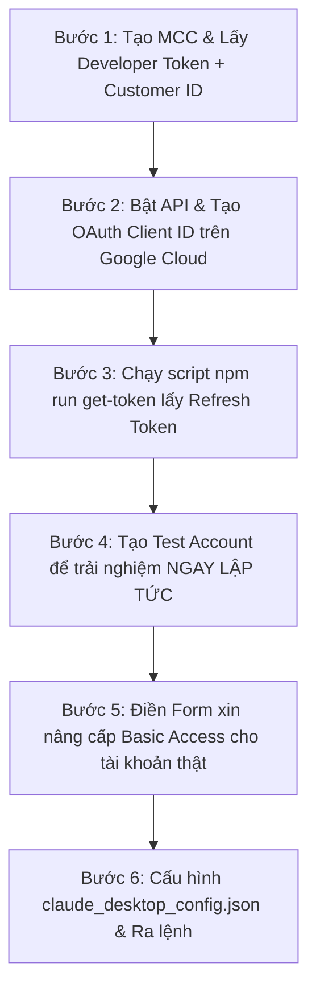

# 🎯 CẨM NANG CHI TIẾT A-Z: CẤU HÌNH GOOGLE ADS MCP SERVER CHO CLAUDE DESKTOP & BÍ QUYẾT DUYỆT TOKEN

> **Dành cho mọi đối tượng:** Bài hướng dẫn này giải thích tường tận cơ chế duyệt Developer Token của Google Ads, hướng dẫn tạo **Tài khoản thử nghiệm (Test Account)** để chạy ứng dụng **NGAY LẬP TỨC**, và cách điền đơn duyệt thành công 100%.

---

## 💡 1. Tại Sao Google Ads API Lại Yêu Cầu Duyệt Phức Tạp Hơn Các Dịch Vụ Khác?

Google Ads trực tiếp quản lý ngân sách và tài khoản ngân hàng của doanh nghiệp. Để tránh nguy cơ rò rỉ dữ liệu hoặc phá hoại chiến dịch quảng cáo, Google phân chia **Developer Token** làm 2 cấp độ:

| Cấp độ Token | Trạng thái mặc định | Quyền hạn truy cập | Thời gian chờ đợi |
|---|---|---|---|
| 🟢 **Test Access (Dùng Thử)** | Có ngay sau khi tạo MCC | Chỉ thao tác được trên các **Tài khoản thử nghiệm (Test Accounts)** | **0 phút** (Chạy thử ngay lập tức!) |
| 🔵 **Basic Access (Chính Thức)** | Cần gửi đơn xin Google duyệt | Thao tác trên tất cả **Tài khoản quảng cáo thật (Production)** | **24h - 48h** làm việc |

> [!TIP]
> **MẸO HAY VƯỢT THỜI GIAN CHỜ:**
> Bạn không cần phải chờ 2 ngày để Google duyệt đơn! Bạn chỉ cần tạo một **Tài khoản thử nghiệm (Test Account)** trong MCC, nhập ID tài khoản đó vào file config là Claude Desktop có thể gọi API đọc/tạo chiến dịch mẫu **ngay lập tức trong hôm nay**!

---

## 📋 2. Tổng Quan 6 Bước Thực Hiện



---

## 📌 BƯỚC 1: Tạo Tài Khoản Quản Lý MCC & Lấy Developer Token

*(Google Ads chỉ cấp Developer Token thông qua Tài khoản Quản lý MCC)*

1. Truy cập trang tạo tài khoản Quản lý: 👉 **[https://ads.google.com/home/tools/manager-accounts/](https://ads.google.com/home/tools/manager-accounts/)**.
2. Nhấn nút màu xanh **Chuyển đến Tài khoản người quản lý** (hoặc *Bắt đầu ngay*).
3. Điền thông tin khởi tạo:
   - **Tên hiển thị tài khoản:** Gõ `MCC Quản Lý Ads`.
   - **Mục đích:** Chọn *Quản lý tài khoản của tôi*.
   - Quốc gia / Múi giờ / Tiền tệ: Giữ nguyên Việt Nam / GMT+7 / VNĐ.
   - Nhấn **Gửi** ➔ Bấm **Khám phá tài khoản của bạn**.

4. **Lấy Developer Token:**
   - Mở link trực tiếp Trung tâm API: 👉 **[https://ads.google.com/aw/apicenter](https://ads.google.com/aw/apicenter)**.
   - Điền form đăng ký API ngắn gọn:
     - Tên công ty / Cá nhân: Điền tên của bạn.
     - Trang web: Điền link website của bạn (hoặc Facebook).
     - Loại hình: Chọn **Các nhà phát triển Google Ads độc lập** (Independent Google Ads Developer).
     - Mục đích: Gõ `Báo cáo và quản lý nội bộ qua AI Assistant`.
   - Tích chọn đồng ý điều khoản ➔ Bấm **Tạo mã thông báo** (Create token).
   - 👉 Mã **Developer Token** (chuỗi ~22 ký tự, ví dụ: `4ZZ4fwjX51cIndShglOdcg`) sẽ xuất hiện. **COPY mã này lại.**

5. **Lấy Customer ID Tài Khoản Thật (10 Chữ Số):**
   - Nhìn lên góc trên bên phải màn hình tài khoản Ads ➔ Copy dãy 10 chữ số dạng `123-456-7890` (bỏ dấu gạch ngang `-`, ví dụ: `1234567890`).

---

## 🔑 BƯỚC 2: Bật Google Ads API & Tạo OAuth Credentials Trên Google Cloud

1. Truy cập trang Google Cloud Credentials: 👉 **[https://console.cloud.google.com/apis/credentials](https://console.cloud.google.com/apis/credentials)**.
2. **Bật Google Ads API:**
   - Truy cập link thư viện: 👉 **[Google Ads API Library](https://console.cloud.google.com/apis/library/googleads.googleapis.com)**.
   - Bấm nút màu xanh **ENABLE** (Bật).

3. **Cấu hình OAuth Audience (Test Users):**
   - Truy cập link: 👉 **[https://console.cloud.google.com/auth/audience](https://console.cloud.google.com/auth/audience)**.
   - Tại mục **Test users**, bấm **+ ADD USERS** ➔ Nhập địa chỉ Gmail của bạn ➔ Bấm **Save**.

4. **Tạo OAuth Client ID:**
   - Quay lại trang [Credentials](https://console.cloud.google.com/apis/credentials) ➔ Bấm **+ CREATE CREDENTIALS** ➔ Chọn **OAuth client ID**.
   - **Application type (Loại ứng dụng):** Chọn **Web application** (Ứng dụng Web) hoặc **Desktop app**.
   - **Name:** Nhập `Claude Ads Client`.
   - Tại phần **Authorized redirect URIs**: Bấm **+ ADD URI** ➔ Nhập chính xác:
     ```text
     http://localhost:3000/oauth2callback
     ```
   - Nhấn **CREATE**.
   - 👉 **COPY 2 chuỗi:** **Client ID** (`xxxx.apps.googleusercontent.com`) và **Client Secret** (`GOCSPX-xxxx`).

---

## ⚡ BƯỚC 3: Chạy Script Tự Động Lấy Refresh Token

Thư mục dự án Google Ads MCP của bạn nằm tại:
`C:\Users\PC\.gemini\antigravity-ide\scratch\google-ads-mcp-unpacked`

1. Mở cửa sổ **PowerShell** trên máy tính và gõ các lệnh thiết lập biến môi trường:

```powershell
cd C:\Users\PC\.gemini\antigravity-ide\scratch\google-ads-mcp-unpacked

$env:GOOGLE_ADS_CLIENT_ID="DÁN_CLIENT_ID_BƯỚC_2_VÀO_ĐÂY"
$env:GOOGLE_ADS_CLIENT_SECRET="DÁN_CLIENT_SECRET_BƯỚC_2_VÀO_ĐÂY"
```

2. Chạy lệnh tự động mở trình duyệt xác thực:
```powershell
npm run get-token
```

3. Một đường link sẽ hiện ra. Mở link trên trình duyệt ➔ Đăng nhập bằng tài khoản Google Ads ➔ Bấm **Cho phép** (Allow).
4. Trình duyệt báo *Thành công!*, trong Terminal sẽ tự động in ra:
   ```text
   GOOGLE_ADS_REFRESH_TOKEN = 1//0gxxxxxxxxxxxxxxxxxxxxxxxxxxxxxxxxxxxxxxxx
   ```
5. 👉 **COPY mã `GOOGLE_ADS_REFRESH_TOKEN` này lại.**

---

## 🧪 BƯỚC 4: Tạo Test Account Để Chạy Thử NGAY LẬP TỨC (Không Cần Chờ Duyệt)

Để dùng thử toàn bộ chức năng của Claude Desktop với Google Ads ngay trong hôm nay:

1. Đăng nhập vào trang quản trị MCC của bạn: 👉 **[https://ads.google.com](https://ads.google.com)**.
2. Tại menu bên trái, bấm vào mục **Tài khoản** (Accounts) ➔ Chọn **Cấu hình** (Management).
3. Nhấn vào nút dấu cộng màu xanh `+` ➔ Chọn **Tạo tài khoản thử nghiệm mới** (Create new test account).
4. Đặt tên: `Tài Khoản Test MCP` ➔ Nhấn **Tạo tài khoản**.
5. Bạn sẽ thấy một **Customer ID 10 số** mới dành riêng cho tài khoản thử nghiệm này (Ví dụ: `987-654-3210`).
6. Dùng Customer ID thử nghiệm này điền vào file `claude_desktop_config.json` ở Bước 6. Tất cả các lệnh đọc/tạo chiến dịch sẽ hoạt động thành công 100%!

---

## 📝 BƯỚC 5: Hướng Dẫn Điền Form Xin Nâng Cấp Basic Access (Để Dùng Cho Tài Khoản Thật)

Khi muốn chuyển từ tài khoản thử nghiệm sang quản lý **tài khoản chạy quảng cáo tiền thật**:

1. Mở trang [Trung tâm API (API Center)](https://ads.google.com/aw/apicenter).
2. Tại dòng *Cấp truy cập (Access level)*, nhấp vào link xin cấp quyền truy cập cơ bản.
3. Mở form đăng ký chính thức của Google: 👉 **[Form Xin Basic Access Google Ads](https://support.google.com/adspolicy/contact/new_token_application)**.
4. **Mẫu câu điền chuẩn để Google duyệt ngay sau 24h:**
   - **MCC ID:** Điền ID tài khoản MCC của bạn (dạng `xxx-xxx-xxxx`).
   - **Project Number:** Lấy từ trang chủ Google Cloud Dashboard (Ví dụ: `755614054363`).
   - **Is this an internal or external tool?** ➔ Chọn: **`Internal users - employees only`** *(Rất quan trọng: Chọn ứng dụng nội bộ để được ưu tiên duyệt nhanh)*.
   - **Tool Description (Mô tả công cụ bằng tiếng Anh):**
     > *"An internal automation reporting tool integrated with Claude Desktop via Model Context Protocol (MCP) to analyze ad performance, monitor daily spend, and update campaign budgets for company internal accounts."*
   - **File thiết kế kèm theo:** Đính kèm file `Claude_Ads_MCP_Design.doc` (đã có sẵn trong thư mục `scratch\google-ads-mcp-unpacked\`).
   - **Campaign types:** Tích chọn `Search`, `Performance Max`, `Display`.
   - **Capabilities:** Tích chọn `Reporting` và `Campaign Management`.
5. Nhấn **Submit**. Google sẽ gửi email thông báo duyệt thành công trong vòng 24h-48h.

---

## 🖥️ BƯỚC 6: Cấu Hình Tệp `claude_desktop_config.json`

1. Nhấn **`Windows + R`** ➔ Gõ `%APPDATA%\Claude\claude_desktop_config.json` ➔ Ấn **Enter**.
2. Thêm đoạn mã dưới đây vào mục `"mcpServers"`:

```json
{
  "mcpServers": {
    "google-ads": {
      "command": "node",
      "args": [
        "C:\\Users\\PC\\.gemini\\antigravity-ide\\scratch\\google-ads-mcp-unpacked\\dist\\index.js"
      ],
      "env": {
        "GOOGLE_ADS_DEVELOPER_TOKEN": "DÁN_DEVELOPER_TOKEN_BƯỚC_1",
        "GOOGLE_ADS_CLIENT_ID": "DÁN_CLIENT_ID_BƯỚC_2",
        "GOOGLE_ADS_CLIENT_SECRET": "DÁN_CLIENT_SECRET_BƯỚC_2",
        "GOOGLE_ADS_REFRESH_TOKEN": "DÁN_REFRESH_TOKEN_BƯỚC_3",
        "GOOGLE_ADS_CUSTOMER_ID": "DÁN_CUSTOMER_ID_THẬT_HOẶC_TEST_ACCOUNT",
        "MAX_DAILY_BUDGET_VND": "5000000"
      }
    }
  }
}
```

---

## 🚀 BƯỚC 7: Khởi Động Lại Claude Desktop & Trải Nghiệm Quản Lý Ads

1. Đóng hoàn toàn phần mềm Claude Desktop (Quit từ khay ứng dụng Taskbar).
2. Mở lại **Claude Desktop**.
3. Các câu lệnh quản lý Ads bằng tiếng Việt tự nhiên:
   - 📊 *"Tóm tắt hiệu suất các chiến dịch Google Ads trong 7 ngày qua giúp tôi."*
   - 🔍 *"Liệt kê danh sách các cụm từ tìm kiếm ngốn tiền nhiều nhất nhưng không tạo ra chuyển đổi."*
   - 💰 *"Kiểm tra xem có chiến dịch nào đang bị hạn chế bởi ngân sách ngày không?"*
   - ⏸️ *"Tạm dừng chiến dịch ID 12345678 giúp tôi."*

---

## ❓ Bảng Giải Trừ Sự Cố & Lỗi Thường Gặp (Troubleshooting)

| Mã lỗi / Hiện tượng | Nguyên nhân | Cách khắc phục triệt để |
|---|---|---|
| **The developer token is approved for test accounts only** | Bạn dùng Developer Token mới (chưa duyệt Basic Access) để gọi vào **Tài khoản thật**. | Mở Bước 4 để tạo một **Test Account**, dùng ID Test Account để chạy thử. Hoặc hoàn tất Bước 5 chờ Google duyệt Basic Access. |
| **Lỗi redirect_uri_mismatch** | Cấu hình sai Redirect URI trong Google Cloud Credentials. | Kiểm tra lại Bước 2.4. Redirect URI phải là `http://localhost:3000/oauth2callback`. |
| **Lỗi 403: access_denied** | Email của bạn chưa nằm trong danh sách Test Users. | Truy cập [OAuth Audience](https://console.cloud.google.com/auth/audience) và bấm **+ ADD USERS** thêm email Gmail của bạn vào. |
