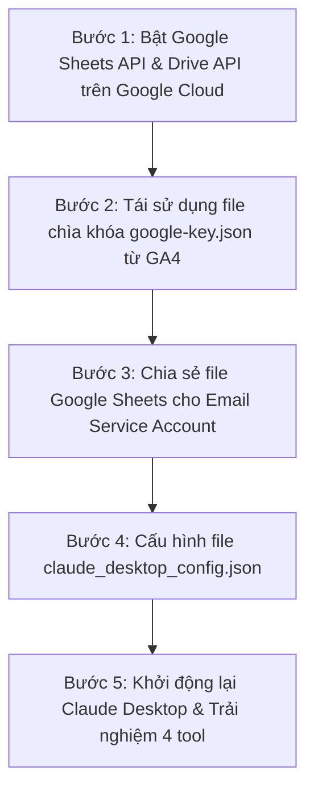

# 🟢 CẨM NANG CHI TIẾT A-Z: CẤU HÌNH GOOGLE SHEETS MCP SERVER CHO CLAUDE DESKTOP

> **Dành cho mọi đối tượng:** Bài hướng dẫn này được thiết kế tỉ mỉ, giúp bạn tận dụng lại chìa khóa bảo mật của GA4 để kết nối Google Sheets với Claude Desktop chỉ trong 5 phút.

---

## 💡 1. Khái Niệm Cơ Bản & Lợi Ích Của Google Sheets MCP Server

### Google Sheets MCP Server Giúp Gì Cho Bạn?
**Google Sheets MCP Server** biến Claude Desktop thành một trợ lý nhập liệu và phân tích dữ liệu tự động. Thay vì làm thủ công, bạn chỉ cần yêu cầu bằng tiếng Việt:
- *"Tạo một file Google Sheets mới tên 'Báo Cáo Doanh Thu Tháng 7' trên Google Drive."*
- *"Đọc dữ liệu bảng tính từ ô A1 đến D50 và tóm tắt xu hướng cho tôi."*
- *"Thêm một dòng dữ liệu khách hàng mới vào cuối file Google Sheets này."*
- *"Cập nhật cột Trạng thái thành 'Đã thanh toán' tại ô E10."*

### Cơ Chế Xác Thực: Dùng Chung Key Với GA4
Google Sheets MCP Server sử dụng cơ chế **Service Account Key (`google-key.json`)**:
- Bạn **KHÔNG CẦN** tạo Service Account mới nếu đã thực hiện theo hướng dẫn GA4!
- Bạn có thể **dùng chung file `google-key.json`** đã tải về ở phần GA4.
- Mỗi khi muốn Claude truy cập file bảng tính nào, bạn chỉ cần mở file Sheets đó ➔ Nhấn **Share (Chia sẻ)** ➔ Thêm email Service Account với quyền **Editor (Người chỉnh sửa)** là xong.

---

## 📋 2. Tổng Quan 5 Bước Thực Hiện



---

## 🛠️ BƯỚC 1: Bật Google Sheets API & Google Drive API Trên Google Cloud Console

1. Truy cập trang quản trị Google Cloud Console tại link:
   👉 **[https://console.cloud.google.com/](https://console.cloud.google.com/)**.
2. Chọn đúng dự án bạn đã dùng cho GA4 (Ví dụ: `GA4-MCP-Claude`).
3. Mở Menu bên trái (Biểu tượng 3 dấu gạch ngang ☰) ➔ Chọn **APIs & Services** (API và Dịch vụ) ➔ Chọn **Library** (Thư viện).

### 1.1 Bật Google Sheets API
- Tại ô tìm kiếm ở giữa màn hình, gõ: `Google Sheets API`.
- Nhấp chuột vào **Google Sheets API** ➔ Nhấn nút màu xanh **ENABLE** (Bật).

### 1.2 Bật Google Drive API
- Quay lại trang **Library** (Thư viện).
- Tại ô tìm kiếm, gõ: `Google Drive API`.
- Nhấp chuột vào **Google Drive API** ➔ Nhấn nút màu xanh **ENABLE** (Bật).
  > [!IMPORTANT]
  > Bắt buộc phải bật cả **Google Drive API**! Khi bạn yêu cầu Claude tạo một file Sheets mới (`create_spreadsheet`), API này sẽ đứng ra tạo và phân quyền tệp trên thư mục Google Drive của bạn.

---

## 🔑 BƯỚC 2: Kiểm Tra & Lưu Tệp Chìa Khóa `google-key.json`

### Trường Hợp A: Đã Làm Theo Hướng Dẫn GA4 (Khuyên Dùng)
Bạn chỉ cần kiểm tra xem tệp `google-key.json` đã nằm sẵn trong thư mục sau chưa:
`C:\Users\PC\.gemini\antigravity-ide\scratch\ga4-mcp-server\google-key.json`

Và ghi nhớ địa chỉ **Email Service Account** của bạn (dạng `ga4-mcp-reader@ga4-mcp-claude.iam.gserviceaccount.com`).

---

### Trường Hợp B: Tạo Mới Nếu Chưa Làm GA4
1. Vào **APIs & Services** ➔ **Credentials** ➔ Nhấn **+ CREATE CREDENTIALS** ➔ Chọn **Service Account**.
2. Đặt tên `sheets-mcp-reader` ➔ Nhấn **CREATE AND CONTINUE** ➔ Nhấn **DONE**.
3. Copy **Email của Service Account** vừa tạo.
4. Bấm vào email ➔ Chọn tab **KEYS** ➔ Nhấn **ADD KEY** ➔ **Create new key** ➔ Chọn **JSON** ➔ Nhấn **CREATE**.
5. Đổi tên tệp vừa tải về thành `google-key.json` và lưu vào thư mục:
   `C:\Users\PC\.gemini\antigravity-ide\scratch\google-sheets-mcp\google-key.json`

---

## 📄 BƯỚC 3: Cách Phân Quyền File Google Sheets Để Claude Có Thể Sửa / Đọc

Mặc định, Service Account là một "tài khoản ẩn". Để Claude thao tác được trên file Google Sheets có sẵn của bạn:

1. Mở file Google Sheets mà bạn muốn Claude làm việc trên trình duyệt web.
2. Nhấn nút màu xanh **Share** (Chia sẻ) ở góc trên bên phải màn hình.
3. Tại ô *Thêm người dùng*, dán địa chỉ **Email Service Account** của bạn vào:
   - *Ví dụ:* `ga4-mcp-reader@ga4-mcp-claude.iam.gserviceaccount.com`
4. Chọn vai trò: **Editor** (Người chỉnh sửa).
5. Nhấn **Send** (Gửi) hoặc **Share** (Chia sẻ).

---

### 📌 Hướng Dẫn Lấy Spreadsheet ID Từ Đường Dẫn URL
Khi ra lệnh cho Claude đọc hoặc sửa file Sheets, Claude sẽ cần mã **Spreadsheet ID**:
- Mở file Google Sheets trên trình duyệt và quan sát thanh địa chỉ URL:
  `https://docs.google.com/spreadsheets/d/1BxiMVs0XRA5nFMdKvBdBZjgmUUqptlbs74OgvE2upms/edit#gid=0`
- Chuỗi nằm giữa `/d/` và `/edit` chính là **Spreadsheet ID**:
  👉 **`1BxiMVs0XRA5nFMdKvBdBZjgmUUqptlbs74OgvE2upms`**
- Copy chuỗi này để cung cấp cho Claude khi ra lệnh.

---

## 🖥️ BƯỚC 4: Cấu Hình Tệp `claude_desktop_config.json`

1. Nhấn **`Windows + R`** trên bàn phím.
2. Nhập chính xác đoạn lệnh sau và ấn **Enter**:
   ```text
   %APPDATA%\Claude\claude_desktop_config.json
   ```

3. Thêm mục `"google-sheets"` vào danh sách `"mcpServers"` trong file:

```json
{
  "mcpServers": {
    "google-sheets": {
      "command": "node",
      "args": [
        "C:\\Users\\PC\\.gemini\\antigravity-ide\\scratch\\google-sheets-mcp\\index.js"
      ],
      "env": {
        "GOOGLE_APPLICATION_CREDENTIALS": "C:\\Users\\PC\\.gemini\\antigravity-ide\\scratch\\ga4-mcp-server\\google-key.json"
      }
    }
  }
}
```

---

## 🚀 BƯỚC 5: Khởi Động Lại Claude Desktop & Trải Nghiệm 4 Tool Sheets

1. Đóng hoàn toàn phần mềm Claude Desktop (nhấp chuột phải vào icon ở khay hệ thống Taskbar ➔ Chọn **Quit Claude**).
2. Mở lại **Claude Desktop**.
3. Nhấn vào biểu tượng cái búa **🛠️ (MCP Tools)** ở góc dưới khung chat để kiểm tra 4 tool của Google Sheets:
   - 🟢 `create_spreadsheet`: Tạo file bảng tính mới trên Google Drive.
   - 🟢 `read_sheet_data`: Đọc dữ liệu từ dải ô trong bảng tính.
   - 🟢 `append_sheet_data`: Thêm các dòng dữ liệu mới vào cuối bảng tính.
   - 🟢 `update_sheet_data`: Ghi đè/Cập nhật dữ liệu vào dải ô chỉ định.

---

## 💬 Mẫu Câu Lệnh Nói Chuyện Với Claude (Tiếng Việt)

- 📝 **Tạo file Google Sheets mới hoàn toàn:**
  > *"Tạo giúp tôi 1 file Google Sheets mới trên Google Drive có tên là 'Danh Sách Khách Hàng Tiềm Năng'."*
- 📊 **Đọc dữ liệu từ file Sheets có sẵn:**
  > *"Đọc dữ liệu từ dải ô Trang_tính_1!A1:E30 của file Sheets ID 1BxiMVs0XRA5nFMdKvBdBZjgmUUqptlbs74OgvE2upms giúp tôi."*
- ➕ **Chèn thêm hàng dữ liệu mới vào cuối bảng:**
  > *"Thêm hàng dữ liệu `['28/07/2026', 'Trần Văn B', 'bao@gmail.com', 'Đã liên hệ']` vào cuối file Sheets ID 1BxiMVs0XRA5nFMdKvBdBZjgmUUqptlbs74OgvE2upms."*
- ✏️ **Cập nhật ô dữ liệu cụ thể:**
  > *"Cập nhật ô E5 thành `['Đã chốt đơn']` trong file Sheets ID 1BxiMVs0XRA5nFMdKvBdBZjgmUUqptlbs74OgvE2upms."*

---

## ❓ Bảng Giải Trừ Sự Cố & Lỗi Thường Gặp (Troubleshooting)

| Mã lỗi / Hiện tượng | Nguyên nhân | Cách khắc phục triệt để |
|---|---|---|
| **Lỗi 404: The caller does not have permission** | Bạn chưa nhấn **Share** chia sẻ file Sheets đó cho Email Service Account. | Mở file Sheets ➔ Nhấn **Share** ➔ Thêm email `ga4-mcp-reader@...` với quyền Editor. |
| **Lỗi 403: Google Sheets API has not been used in project...** | Chưa nhấn nút Enable Google Sheets API trên Cloud Console. | Mở lại Bước 1.1 ➔ Tìm **Google Sheets API** và bấm **ENABLE**. |
| **Lỗi 403: Google Drive API has not been used in project...** | Chưa bật Google Drive API khi dùng lệnh tạo file mới `create_spreadsheet`. | Mở lại Bước 1.2 ➔ Tìm **Google Drive API** và bấm **ENABLE**. |
| **Unable to parse range** | Nhập sai tên trang tính (Sheet name) hoặc sai ký tự dải ô. | Kiểm tra lại tên Sheet bên dưới thanh tab (ví dụ: `Sheet1` hay `Trang tính 1`) và định dạng ô (ví dụ: `Sheet1!A1:D10`). |
