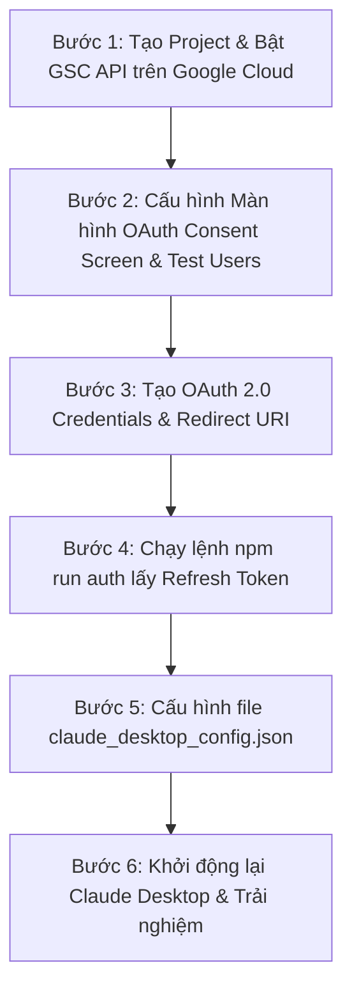

# 🔍 CẨM NANG CHI TIẾT A-Z: CẤU HÌNH GOOGLE SEARCH CONSOLE (GSC) MCP SERVER CHO CLAUDE DESKTOP

> **Dành cho mọi đối tượng:** Bài hướng dẫn này biên soạn từng bước rõ ràng, giải thích tỉ mỉ từ thao tác click chuột trên Google Cloud Console đến việc cấp quyền SEO để ai cũng có thể tự cài đặt thành công.

---

## 💡 1. Khái Niệm Cơ Bản & Cơ Chế Hoạt Động

### GSC MCP Server Giúp Gì Cho Bạn?
**Google Search Console (GSC)** là công cụ quản lý thứ hạng từ khóa và tình trạng lập chỉ mục (index) website của Google. Khi kết nối GSC với **Claude Desktop** qua giao thức MCP, bạn có thể phân tích SEO trực tiếp bằng cách hỏi Claude:
- *"Top 20 từ khóa mang lại nhiều lượt click nhất tháng vừa qua?"*
- *"Bài viết /blog/abc-xyz đã được Google index chưa?"*
- *"Trang web của tôi có bị lỗi sitemap nào không?"*

### Cơ Chế Xác Thực OAuth 2.0 & Refresh Token Là Gì?
Khác với GA4 dùng Service Account (Robot), GSC sử dụng cơ chế **OAuth 2.0 (Xác thực người dùng)**:
- **Client ID & Client Secret:** Mã định danh giống như "Tên đăng nhập & Mật khẩu ứng dụng" của bạn trên Google Cloud.
- **Refresh Token:** Mã xác thực dài hạn cho phép Claude đại diện chính tài khoản Google của bạn truy cập dữ liệu Search Console mà không phải đăng nhập lại mỗi ngày.

---

## 📋 2. Tổng Quan 6 Bước Thực Hiện



---

## 🛠️ BƯỚC 1: Tạo Project & Bật Google Search Console API

1. Truy cập vào trang quản trị Google Cloud Console tại link:
   👉 **[https://console.cloud.google.com/](https://console.cloud.google.com/)** *(Đăng nhập tài khoản Google quản lý Search Console của bạn)*.

2. **Tạo Dự án mới (Project):**
   - Nhìn lên thanh header màu xanh ở trên cùng ➔ Bấm vào ô chọn dự án.
   - Bấm vào nút **NEW PROJECT** (Dự án mới) ở góc trên bên phải.
   - **Project Name (Tên dự án):** Gõ `GSC-MCP-Claude`.
   - Nhấn **CREATE** (Tạo) và chọn dự án `GSC-MCP-Claude` vừa tạo.

3. **Bật Google Search Console API:**
   - Mở Menu bên trái (Biểu tượng 3 dấu gạch ngang ☰) ➔ Chọn **APIs & Services** (API và Dịch vụ) ➔ Chọn **Library** (Thư viện).
   - Tại ô tìm kiếm, gõ chính xác: `Google Search Console API`.
   - Nhấp chuột vào **Google Search Console API** ➔ Nhấn nút màu xanh **ENABLE** (Bật).

---

## 🔐 BƯỚC 2: Cấu Hình Màn Hình Xác Thực OAuth (OAuth Consent Screen)

Google yêu cầu thiết lập màn hình xác nhận đồng ý cấp quyền trước khi tạo mã kết nối.

1. Mở lại Menu bên trái (☰) ➔ **APIs & Services** ➔ Chọn **OAuth consent screen** (Màn hình xác thực OAuth).
2. Tại mục **User Type** (Loại người dùng):
   - Chọn **External** (Ngoại bộ) nếu bạn sử dụng tài khoản Gmail cá nhân (`@gmail.com`).
   - Chọn **Internal** (Nội bộ) nếu bạn dùng tài khoản Google Workspace doanh nghiệp.
   - Nhấn nút **CREATE** (Tạo).

3. **Điền thông tin ứng dụng:**
   - **App name (Tên ứng dụng):** Gõ `GSC MCP Client`.
   - **User support email:** Chọn địa chỉ Email Gmail của bạn.
   - **Developer contact information:** Nhập địa chỉ Email của bạn.
   - Nhấn **SAVE AND CONTINUE** (Lưu và tiếp tục).

4. **Mục Scopes (Phạm vi):** Bỏ qua, nhấn tiếp **SAVE AND CONTINUE**.

5. **CỰC KỲ QUAN TRỌNG — Mục Test Users (Người dùng thử nghiệm):**
   - Nhấn vào nút **+ ADD USERS** (Thêm người dùng).
   - Nhập chính xác địa chỉ **Gmail cá nhân của bạn** (Tài khoản đang sở hữu trang web trên Google Search Console).
   - Nhấn **ADD** ➔ Nhấn **SAVE AND CONTINUE**.
   > [!WARNING]
   > Nếu không điền email của bạn vào danh sách **Test Users**, Google sẽ chặn đăng nhập với lỗi `Access blocked: App hasn't completed the Google verification process`.

---

## 🔑 BƯỚC 3: Tạo OAuth 2.0 Credentials (Client ID & Client Secret)

1. Mở Menu bên trái (☰) ➔ **APIs & Services** ➔ Chọn **Credentials** (Thông tin xác thực).
2. Bấm nút **+ CREATE CREDENTIALS** ở mép trên màn hình ➔ Chọn **OAuth client ID**.
3. Tại ô **Application type** (Loại ứng dụng):
   - Chọn **Web application** (Ứng dụng Web).
4. **Name:** Nhập `GSC MCP OAuth Client`.

5. **Thiết lập Authorized redirect URIs (URI chuyển hướng được ủy quyền):**
   - Cuộn xuống phần *Authorized redirect URIs* ➔ Nhấn nút **+ ADD URI**.
   - Nhập chính xác từng ký tự đường dẫn sau:
     ```text
     http://localhost:8765/oauth2callback
     ```
   > [!IMPORTANT]
   > Hãy kiểm tra kỹ: Phải là `http://localhost:8765/oauth2callback` (đúng cổng `8765`, không thừa dấu `/` ở cuối).

6. Nhấn nút **CREATE** (Tạo).
7. Cửa sổ hiện ra cung cấp 2 mã bảo mật:
   - **Client ID:** Dạng `xxxxxxxxxxxx-xxxxxxxxxxxxxxxx.apps.googleusercontent.com`
   - **Client Secret:** Dạng `GOCSPX-xxxxxxxxxxxxxxxxxxxx`
   - 👉 **Hãy bôi đen và COPY lại 2 chuỗi mã này!**

---

## ⚡ BƯỚC 4: Chạy Script Tự Động Lấy Refresh Token

Thư mục GSC MCP server của bạn đã được chuẩn bị sẵn tại:
`C:\Users\PC\.gemini\antigravity-ide\scratch\gsc-mcp-server`

1. Mở thư mục `C:\Users\PC\.gemini\antigravity-ide\scratch\gsc-mcp-server`.
2. Mở file `.env` (Nếu chưa có, tạo mới file đặt tên là `.env`).
3. Dán 2 mã vừa lấy ở Bước 3 vào file `.env` theo mẫu:

   ```env
   GSC_CLIENT_ID=xxxxxxxxxxxx-xxxxxxxxxxxxxxxx.apps.googleusercontent.com
   GSC_CLIENT_SECRET=GOCSPX-xxxxxxxxxxxxxxxxxxxx
   ```

4. Mở cửa sổ **PowerShell** hoặc **Terminal** tại thư mục `C:\Users\PC\.gemini\antigravity-ide\scratch\gsc-mcp-server` và gõ lệnh:
   ```bash
   npm run auth
   ```

5. Trình duyệt web sẽ tự động bật lên trang đăng nhập Google:
   - Chọn tài khoản Google sở hữu website trên Google Search Console.
   - Nếu màn hình hiện cảnh báo *"Google hasn't verified this app"*, nhấn **Continue** (Tiếp tục) hoặc **Advanced ➔ Go to GSC MCP Client (unsafe)**.
   - Bấm nút **Allow** (Đồng ý / Cho phép) để cấp quyền cho phép đọc dữ liệu Search Console.

6. Trình duyệt báo *"Authentication successful! You can close this window."*.
7. Quay lại cửa sổ Terminal, bạn sẽ thấy mã **Refresh Token** đã được tự động tạo ra:
   ```text
   GSC_REFRESH_TOKEN=1//0gxxxxxxxxxxxxxxxxxxxxxxxxxxxxxxxxxxxxxxxx
   ```
8. 👉 **COPY chuỗi `GSC_REFRESH_TOKEN` này lại.**

---

## 🖥️ BƯỚC 5: Cấu Hình Tệp `claude_desktop_config.json`

1. Nhấn tổ hợp phím **`Windows + R`** trên bàn phím.
2. Nhập chính xác đoạn lệnh sau và ấn **Enter**:
   ```text
   %APPDATA%\Claude\claude_desktop_config.json
   ```

3. Dán đoạn mã cấu hình dưới đây vào mục `"mcpServers"` (thay các chuỗi Client ID, Client Secret, Refresh Token của bạn vào):

```json
{
  "mcpServers": {
    "google-search-console": {
      "command": "node",
      "args": [
        "C:\\Users\\PC\\.gemini\\antigravity-ide\\scratch\\gsc-mcp-server\\index.js"
      ],
      "env": {
        "GSC_CLIENT_ID": "your-client-id.apps.googleusercontent.com",
        "GSC_CLIENT_SECRET": "your-client-secret",
        "GSC_REFRESH_TOKEN": "your-refresh-token"
      }
    }
  }
}
```

---

## 🚀 BƯỚC 6: Khởi Động Lại Claude Desktop & Trải Nghiệm 5 Tool SEO

1. Đóng hoàn toàn phần mềm Claude Desktop (nhấp chuột phải vào icon ở khay hệ thống Taskbar ➔ Chọn **Quit Claude**).
2. Mở lại **Claude Desktop**.
3. Nhấn vào biểu tượng cái búa **🛠️ (MCP Tools)** ở góc dưới khung chat để kiểm tra 5 tool của GSC:
   - 🟢 `list_sites`: Liệt kê các website bạn quản lý trong Search Console.
   - 🟢 `search_analytics`: Truy vấn chi tiết Clicks, Impressions, CTR, Vị trí từ khóa.
   - 🟢 `inspect_url`: Kiểm tra tình trạng index của 1 link cụ thể trên Google.
   - 🟢 `list_sitemaps`: Xem danh sách sitemap đã gửi và tình trạng lỗi.
   - 🟢 `submit_sitemap`: Gửi sitemap mới lên Google.

---

## 💬 Mẫu Câu Lệnh Nói Chuyện Với Claude (Tiếng Việt)

- 🌐 **Xem danh sách website đang quản lý:**
  > *"Liệt kê tất cả các website (property) mà tôi có quyền quản lý trong Google Search Console."*
- 📈 **Báo cáo từ khóa SEO hiệu quả nhất:**
  > *"Cho tôi Top 20 từ khóa có nhiều lượt nhấp (Clicks) nhất và vị trí trung bình tốt nhất trong 28 ngày qua của website https://example.com/."*
- 🔍 **Kiểm tra tình trạng Index bài viết mới:**
  > *"Kiểm tra giúp tôi xem link bài viết https://example.com/blog/huong-dan-seo đã được Google lập chỉ mục (index) chưa?"*
- 🗺️ **Kiểm tra Sitemap:**
  > *"Liệt kê danh sách sitemap đã submit của trang https://example.com/ và xem có sitemap nào bị báo lỗi không."*

---

## ❓ Bảng Giải Trừ Sự Cố & Lỗi Thường Gặp (Troubleshooting)

| Mã lỗi / Hiện tượng | Nguyên nhân | Cách khắc phục triệt để |
|---|---|---|
| **redirect_uri_mismatch** | Nhập sai URI chuyển hướng trong Google Cloud Credentials. | Kiểm tra lại Bước 3.5. Đường dẫn phải là `http://localhost:8765/oauth2callback` (chính xác cổng `8765`). |
| **Access blocked: App hasn't completed verification** | Email đăng nhập của bạn chưa được thêm vào Test Users. | Mở lại Bước 2.5 ➔ Vào mục **Test users** ➔ Thêm chính xác địa chỉ Gmail cá nhân của bạn vào. |
| **invalid_grant** | Refresh Token đã bị hết hạn hoặc bị thu hồi quyền truy cập. | Mở lại Terminal tại thư mục `scratch\gsc-mcp-server` và chạy lại lệnh `npm run auth` để lấy Refresh Token mới. |
| **User does not have sufficient permission** | Tài khoản Google đăng nhập ở bước Auth không có quyền truy cập website đó trong GSC. | Mở [Google Search Console](https://search.google.com/search-console) trên web và kiểm tra xem tài khoản Gmail đó đã được xác minh quyền sở hữu website chưa. |
