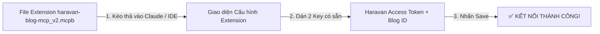

# 🛍️ CẨM NANG CHI TIẾT A-Z: CÀI ĐẶT & KẾT NỐI HARAVAN BLOG MCP SERVER (V2.0)
### 🚀 ÁP DỤNG CHO: CLAUDE DESKTOP, ANTIGRAVITY IDE & MCP CLIENTS (EXTENSION `.mcpb` HOẶC MANUAL CONFIG)

> [!IMPORTANT]
> **⚡ BẠN ĐÃ CÓ SẴN KEY RỒI?**
> Nếu bạn đã có sẵn 2 mã key (`HARAVAN_ACCESS_TOKEN` và `HARAVAN_BLOG_ID`), bạn **KHÔNG CẦN** truy cập Haravan Admin hay làm bất kỳ thao tác tạo app nào nữa! Chỉ cần thực hiện **30 giây** ở **Mục 1** bên dưới là hoàn tất 100%.

---

## ⚡ 1. Quy Trình Kết Nối Siêu Tốc 30 Giây (Khi Đã Có Sẵn Keys)

Do bạn đã có sẵn file Extension `haravan-blog-mcp_v2.mcpb` và bộ Key, bạn chỉ cần thực hiện 3 bước cực kỳ đơn giản:



### Các Bước Thực Hiện Chi Tiết:

1. **Mở Trình Quản Lý Extension:**
   - Trên **Claude Desktop** hoặc **Antigravity IDE**, mở **Settings (Cài đặt)** ➔ Chọn **Extensions** (hoặc **MCP Clients**).
2. **Import File Extension:**
   - Nhấn nút **Import Extension** hoặc kéo thả trực tiếp tệp `haravan-blog-mcp_v2.mcpb` vào ứng dụng.
3. **Dán 2 Mã Key Có Sẵn Vào Ô Tương Ứng:**
   - 🟩 **Haravan Access Token** *(Bắt buộc)*: Dán chuỗi Access Token có sẵn của bạn vào ô này.
   - 🟦 **Blog ID mặc định** *(Tùy chọn)*: Dán mã Blog ID có sẵn của bạn vào ô này (nếu không điền, AI sẽ mặc định cho bạn chọn blog mỗi khi đăng bài).
4. **Nhấn Save / Confirm:**
   - Hoàn tất! AI đã kết nối thành công với Haravan và sẵn sàng nhận lệnh đăng bài / quản lý blog.

---

## 💡 2. Tại Sao Dùng Extension `.mcpb` Lại Tiện Hơn Cấu Hình Thủ Công?

- **Không cần đụng vào code:** Không cần cài môi trường Node.js, không cần tạo folder hay tải npm packages.
- **Không bao giờ sợ lỗi file JSON:** Trước đây khi sửa file `claude_desktop_config.json`, người dùng rất hay bị lỗi cú pháp (thiếu dấu phẩy, thừa ngoặc, gõ sai đường dẫn file `index.js`). Extension `.mcpb` xóa bỏ hoàn toàn rủi ro này bằng giao diện nhập liệu trực quan.

---

## 🛠️ 3. (Tham Khảo) Cấu Hình Thủ Công Bằng File JSON

Nếu bạn muốn cấu hình qua file `claude_desktop_config.json` thay vì dùng giao diện `.mcpb`:

1. Mở file `claude_desktop_config.json`:
   - **Windows:** `%APPDATA%\Claude\claude_desktop_config.json`
   - **macOS:** `~/Library/Application Support/Claude/claude_desktop_config.json`
2. Thêm đoạn JSON sau (thay 2 key có sẵn của bạn vào):

```json
{
  "mcpServers": {
    "haravan-blog": {
      "command": "node",
      "args": [
        "C:/Users/PC/.gemini/antigravity-ide/scratch/haravan-blog-mcp_1/index.js"
      ],
      "env": {
        "HARAVAN_ACCESS_TOKEN": "DÁN_ACCESS_TOKEN_CÓ_SẴN_CỦA_BẠN",
        "HARAVAN_BLOG_ID": "DÁN_BLOG_ID_CÓ_SẴN_CỦA_BẠN"
      }
    }
  }
}
```

---

## 📋 4. BẢNG CHI TIẾT 22 TÍNH NĂNG (MCP TOOLS) ĐÃ TÍCH HỢP

Haravan Blog Manager MCP v2.0 cung cấp đầy đủ 22 công cụ tự động hóa:

### 📗 1. Quản lý Danh mục Blog (6 Tools)
| Tên Tool MCP | Chức năng chi tiết |
|---|---|
| `list_blogs` | Lấy danh sách tất cả các danh mục Blog (tin tức, kiến thức, khuyến mãi...) trên cửa hàng. |
| `count_blogs` | Đếm tổng số danh mục Blog đang có trên Haravan. |
| `get_blog` | Xem chi tiết thông tin của 1 danh mục Blog cụ thể theo ID. |
| `create_blog` | Tạo thêm danh mục Blog mới. |
| `update_blog` | Chỉnh sửa tên, tiêu đề SEO, mô tả và đường dẫn (handle) của danh mục Blog. |
| `delete_blog` | Xóa danh mục Blog khỏi hệ thống. |

### 📘 2. Quản lý Bài Viết Blog (6 Tools)
| Tên Tool MCP | Chức năng chi tiết |
|---|---|
| `list_articles` | Xem danh sách bài viết trong blog, hỗ trợ lọc nâng cao theo trạng thái xuất bản, tag, tác giả, phân trang. |
| `count_articles` | Đếm tổng số bài viết trong danh mục Blog. |
| `get_article` | Đọc toàn bộ chi tiết 1 bài viết (tiêu đề, nội dung HTML, tác giả, tags, ảnh đại diện, cấu hình SEO). |
| `create_article` | **Đăng bài viết mới lên Haravan** với nội dung HTML định dạng đẹp, ảnh bìa, thẻ tags, và lịch xuất bản. |
| `update_article` | Sửa tiêu đề, cập nhật nội dung bài viết, đổi trạng thái Đăng/Ẩn bài viết trên website. |
| `delete_article` | Xóa bài viết khỏi Haravan. |

### 📙 3. Quản lý Bình Luận & Tương Tác (10 Tools)
| Tên Tool MCP | Chức năng chi tiết |
|---|---|
| `list_comments` | Đọc danh sách các bình luận của độc giả trên các bài blog. |
| `count_comments` | Đếm tổng số lượng bình luận. |
| `get_comment` | Xem thông tin chi tiết của một bình luận. |
| `create_comment` | Đăng bình luận mới hoặc phản hồi người đọc. |
| `update_comment` | Chỉnh sửa nội dung bình luận. |
| `mark_comment_spam` | Đánh dấu bình luận vi phạm / chứa spam link. |
| `mark_comment_not_spam` | Hủy đánh dấu bình luận spam. |
| `approve_comment` | Duyệt bình luận cho phép hiển thị công khai trên website Haravan. |
| `remove_comment` | Xóa bình luận. |
| `restore_comment` | Khôi phục lại bình luận đã bị xóa. |

---

## 🤖 5. CÁC CÂU LỆNH MẪU (PROMPTS) THỰC TẾ

Sau khi kích hoạt, bạn có thể ra lệnh trực tiếp cho AI bằng tiếng Việt tự nhiên:

### 🔹 1. Kiểm tra danh mục Blog
> *"Hãy kiểm tra xem shop Haravan của tôi có những danh mục Blog nào và cho tôi biết ID của từng danh mục."*

### 🔹 2. Viết & Đăng bài tự động chuẩn SEO
> *"Hãy viết một bài blog chuẩn SEO với chủ đề: 'Hướng Dẫn Lựa Chọn Mới Nhất Cho Năm 2026'. Bài viết dài khoảng 1200 chữ, dùng định dạng HTML đẹp mắt có h2, h3, danh sách bullet point. Sau khi viết xong, hãy đăng bài viết này lên Blog Haravan mặc định giúp tôi với tác giả 'Ban Biên Tập' và tag 'Kinh Nghiệm, SEO 2026'."*

### 🔹 3. Cập nhật bài viết sẵn có
> *"Tìm bài viết có ID 1009876543 trên Haravan, kiểm tra lại thẻ tiêu đề SEO và bổ sung thêm 1 đoạn tóm tắt ngắn (summary) hấp dẫn 200 từ cho bài viết đó."*

### 🔹 4. Kiểm duyệt bình luận rác
> *"Hãy quét danh sách bình luận mới nhất trên Haravan Blog. Nếu phát hiện bình luận nào chứa các liên kết lừa đảo hoặc từ ngữ rác, hãy dùng tool đánh dấu spam cho tôi."*

---

## ❓ 6. BẢNG XỬ LÝ LỖI THƯỜNG GẶP (TROUBLESHOOTING)

| Hiện tượng lỗi | Nguyên nhân phổ biến | Cách khắc phục xử lý |
|---|---|---|
| **HTTP 401 Unauthorized** | Mã `HARAVAN_ACCESS_TOKEN` bị điền sai hoặc copy thiếu ký tự. | Kiểm tra lại chuỗi Access Token có sẵn và dán chính xác vào Extension. |
| **HTTP 403 Forbidden** | Mã Key chưa được cấp đủ quyền **Read & Write** cho mục *Articles / Blogs*. | Cần đảm bảo Key của bạn có quyền thao tác dữ liệu bài viết Haravan. |
| **Invalid Blog ID / Not Found** | Mã Blog ID nhập vào bị sai hoặc không thuộc trang web này. | Nhắn cho AI: *"Xem danh sách blog"* để AI tự động tra cứu mã Blog ID chính xác từ API. |
| **MCP Server Not Responding** | Chưa khởi động lại ứng dụng Claude Desktop sau khi cập nhật file config JSON. | Tắt hẳn Claude Desktop (kiểm tra khay hệ thống Taskbar ở góc màn hình) và mở lại. |

---

## 📌 7. (Dành Cho Tham Khảo) Hướng Dẫn Lấy Keys Từ Haravan Admin Khi Cần Tạo Mới

Nếu sau này bạn cần tạo một bộ mã Key mới từ trang Haravan Admin:
1. Đăng nhập Haravan Admin ➔ **Cấu hình (Settings)** ⚙️ ➔ **Ứng dụng (Apps)** ➔ **Ứng dụng riêng (Private Apps)** ➔ **Tạo ứng dụng riêng mới**.
2. Chọn quyền **Bài viết (Articles / Blogs)**: **Read & Write** ➔ Bấm **Lưu** ➔ Copy **Access Token** (`HARAVAN_ACCESS_TOKEN`).
3. Vào **Website** ➔ **Blog / Bài viết** ➔ Chọn 1 danh mục ➔ Copy dãy số phía sau `/blogs/` trên thanh URL (`HARAVAN_BLOG_ID`).

---
*Tài liệu được cập nhật tối ưu cho quy trình nhập Key có sẵn nhanh nhất.*
